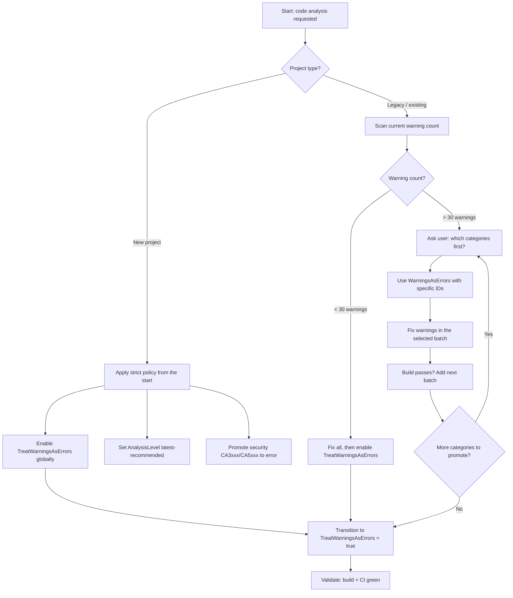

# .NET Code Analysis

## Trigger On

- the repo wants first-party .NET analyzers
- CI should fail on analyzer warnings
- the team needs `AnalysisLevel` or `AnalysisMode` guidance
- the repo needs a gradual Roslyn warning promotion strategy

## Value

- produce a concrete project delta: code, docs, config, tests, CI, or review artifact
- reduce ambiguity through explicit planning, verification, and final validation skills
- leave reusable project context so future tasks are faster and safer

## Do Not Use For

- third-party analyzer selection by itself
- formatting-only work

## Inputs

- the nearest `AGENTS.md`
- project files or `Directory.Build.props`
- current analyzer severity policy

## Quick Start

1. Read the nearest `AGENTS.md` and confirm scope and constraints.
2. Run this skill's `Workflow` through the `Ralph Loop` until outcomes are acceptable.
3. Return the `Required Result Format` with concrete artifacts and verification evidence.

## Hard Rules for AI Agents

These rules are non-negotiable. Violating them undermines the user's explicit intent.

1. **Never disable or remove `TreatWarningsAsErrors` or `WarningsAsErrors`** if the user or the project has set them. Do not comment them out, set them to `false`, move them behind a condition, or add `<TreatWarningsAsErrors>false</TreatWarningsAsErrors>` to make the build pass.
2. **Never add `<NoWarn>` entries or `#pragma warning disable` to suppress warnings that the user has chosen to treat as errors**, unless the user explicitly approves the suppression for a specific case.
3. **Never silently downgrade rule severity** in `.editorconfig` (e.g., changing `error` to `warning` or `none`) to make a build succeed.
4. If a build fails because of warnings-as-errors, **fix the actual code issue**. If the fix is too large or risky, **ask the user** whether to defer that specific warning ID instead of silently disabling it.
5. If the volume of warnings is too large to fix in one pass, **report the count and categories to the user** and ask which ones to tackle first — do not unilaterally disable the policy.

## Workflow

### Decision Flow



### Steps

1. Start with SDK analyzers before adding third-party packages.
2. **Detect project maturity**: is this a new project or an existing/legacy codebase?
3. Enable or document:
   - `EnableNETAnalyzers`
   - `AnalysisLevel`
   - `AnalysisMode`
4. **Apply the right warning promotion strategy** (see below).
5. Keep per-rule severity in the repo-root `.editorconfig`.
6. Use `dotnet build` as the analyzer execution gate in CI.
7. Add third-party analyzers only for real gaps that first-party rules do not cover.

## Warning Promotion Strategy

### New Projects

For new or small projects with few existing warnings:

- Set `<TreatWarningsAsErrors>true</TreatWarningsAsErrors>` in `Directory.Build.props` immediately.
- Set `<AnalysisLevel>latest-recommended</AnalysisLevel>`.
- Promote security rules (CA3xxx, CA5xxx) to error in `.editorconfig`.
- Fix all warnings before merging. The project is young enough that this is manageable.

### Legacy / Existing Projects — Gradual Promotion

For established codebases, a blanket `TreatWarningsAsErrors` will produce hundreds or thousands of errors. An AI agent cannot realistically fix them all at once, and attempting it will flood context and produce low-quality fixes. Instead, promote warnings to errors in deliberate batches.

#### Phase 1: Trivial Hygiene (lowest effort, highest signal-to-noise)

Start here. These warnings are trivial to fix mechanically and reduce noise for the real work:

| Warning ID | Description | Typical fix |
|-----------|-------------|-------------|
| CS8019 | Unnecessary using directive | Remove the unused using |
| CS0219 | Variable assigned but never used | Remove the variable |
| CS0168 | Variable declared but never used | Remove the variable |
| CS1591 | Missing XML comment for public type/member | Add doc comment or disable for internal code |
| CS0612 | Use of obsolete member (no message) | Replace with non-obsolete API |
| CS0618 | Use of obsolete member (with message) | Follow the migration guidance |

Promote these first:

```xml
<PropertyGroup>
  <WarningsAsErrors>CS8019;CS0219;CS0168</WarningsAsErrors>
</PropertyGroup>
```

Fix all occurrences, then move to Phase 2.

#### Phase 2: Code Quality (medium effort, high value)

| Warning ID | Description | Category |
|-----------|-------------|----------|
| CA2000 | Dispose objects before losing scope | Reliability |
| CA1062 | Validate arguments of public methods | Design |
| CA1822 | Mark members as static | Performance |
| CA1860 | Avoid using Enumerable.Any() for length check | Performance |
| CA1861 | Avoid constant arrays as arguments | Performance |
| CA2007 | Consider calling ConfigureAwait | Reliability |
| CS8600–CS8610 | Nullable reference type warnings | Nullability |

**Ask the user**: "Which of these categories do you want to promote next? Nullability? Performance? Reliability?"

Add the selected IDs to `WarningsAsErrors` and fix them before adding more.

#### Phase 3: Security (high priority, always promote)

| Warning ID | Description |
|-----------|-------------|
| CA3001 | Review code for SQL injection |
| CA3002 | Review code for XSS |
| CA3003 | Review code for file path injection |
| CA3075 | Insecure DTD processing |
| CA5350 | Do not use weak cryptographic algorithms |
| CA5351 | Do not use broken cryptographic algorithms |
| CA5394 | Do not use insecure randomness |

These should be promoted to error early regardless of project maturity. Set in `.editorconfig`:

```editorconfig
[*.cs]
dotnet_analyzer_diagnostic.category-Security.severity = error
```

#### Phase 4: Full Coverage

Once all targeted batches pass cleanly, transition from selective `WarningsAsErrors` to global `TreatWarningsAsErrors`:

```xml
<PropertyGroup>
  <TreatWarningsAsErrors>true</TreatWarningsAsErrors>
  <!-- Explicit exceptions for warnings you've decided to keep as warnings -->
  <WarningsNotAsErrors>CA1707</WarningsNotAsErrors>
</PropertyGroup>
```

### Interaction Protocol

When applying warning promotion to a legacy codebase:

1. **Run `dotnet build` and count warnings** by ID and category.
2. **Report the summary to the user**: "Found 47 CS8019, 23 CA1822, 12 CA2000, 8 CS8600 warnings."
3. **Ask the user which batch to tackle**: "I recommend starting with CS8019 (unused usings) and CS0219 (unused variables) — these are mechanical fixes. Want me to proceed?"
4. **Fix the selected batch** and verify the build passes.
5. **Add those IDs to `WarningsAsErrors`** so they stay enforced going forward.
6. **Report back** and ask about the next batch.

Never skip the ask step. The user decides the pace.

## Bootstrap When Missing

If first-party .NET code analysis is requested but not configured yet:

1. Detect current state:
   - `dotnet --info`
   - `rg -n "EnableNETAnalyzers|AnalysisLevel|AnalysisMode|TreatWarningsAsErrors|WarningsAsErrors" -g '*.csproj' -g 'Directory.Build.*' .`
   - `dotnet build SOLUTION_OR_PROJECT 2>&1` — count current warnings by ID
2. Treat SDK analyzers as built-in functionality, not as a separate third-party install path.
3. Classify the project: new (few or zero warnings) vs. legacy (many warnings).
4. Enable the needed properties in the solution's MSBuild config, typically in `Directory.Build.props` or the target project file:
   - `EnableNETAnalyzers`
   - `AnalysisLevel`
   - `AnalysisMode` when needed
5. **Apply the appropriate warning promotion strategy** based on project maturity:
   - New project: apply strict policy immediately.
   - Legacy project: start with Phase 1 and ask the user before each batch.
6. Keep rule-level severity in the repo-root `.editorconfig`.
7. Run `dotnet build SOLUTION_OR_PROJECT` and return `status: configured` or `status: improved`.
8. If the repo intentionally defers analyzer policy to another documented build layer, return `status: not_applicable`.

## Deliver

- first-party analyzer policy that is explicit and reviewable
- build-time analyzer execution for CI
- warning promotion roadmap that matches the project's maturity

## Validate

- analyzer behavior is driven by repo config, not IDE defaults
- CI can reproduce the same warnings and errors locally
- no `TreatWarningsAsErrors`, `WarningsAsErrors`, or severity settings were removed or weakened by the agent without user approval
- promoted warnings produce build errors, not just IDE hints

## Ralph Loop

Use the Ralph Loop for every task, including docs, architecture, testing, and tooling work.

1. Plan first (mandatory):
   - analyze current state
   - define target outcome, constraints, and risks
   - write a detailed execution plan
   - list final validation skills to run at the end, with order and reason
2. Execute one planned step and produce a concrete delta.
3. Review the result and capture findings with actionable next fixes.
4. Apply fixes in small batches and rerun the relevant checks or review steps.
5. Update the plan after each iteration.
6. Repeat until outcomes are acceptable or only explicit exceptions remain.
7. If a dependency is missing, bootstrap it or return `status: not_applicable` with explicit reason and fallback path.

### Required Result Format

- `status`: `complete` | `clean` | `improved` | `configured` | `not_applicable` | `blocked`
- `plan`: concise plan and current iteration step
- `actions_taken`: concrete changes made
- `validation_skills`: final skills run, or skipped with reasons
- `verification`: commands, checks, or review evidence summary
- `remaining`: top unresolved items or `none`

For setup-only requests with no execution, return `status: configured` and exact next commands.

## Load References

- read `references/rules.md` for SDK analyzer rule categories and severity guidance
- read `references/config.md` for AnalysisLevel, AnalysisMode, and .editorconfig settings

## Example Requests

- "Turn on built-in .NET analyzers."
- "Make analyzer warnings fail the build."
- "Set the right `AnalysisLevel` for this repo."
- "Start treating unused usings and unused variables as errors."
- "Help me gradually promote Roslyn warnings in my legacy project."
- "Which warnings should I promote to errors next?"
