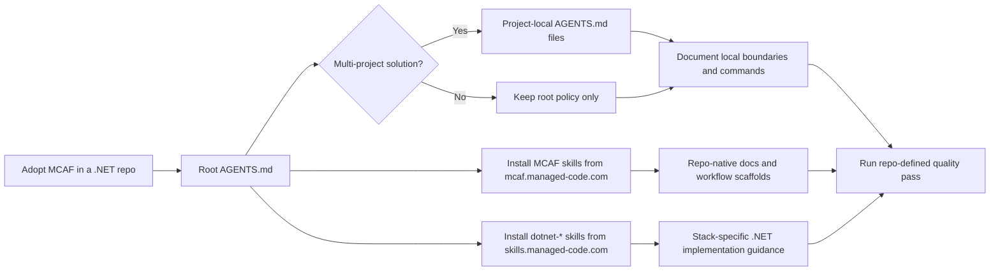

# MCAF for .NET Repositories

## Trigger On

- bootstrapping MCAF in a new or existing `.NET` repository
- updating root or project-local `AGENTS.md` files to follow a durable repo workflow
- deciding which MCAF skills and `dotnet-*` skills a `.NET` solution should install
- organizing repo-native docs for architecture, features, ADRs, testing, development, and operations
- aligning AI-agent workflow with explicit build, test, format, analyze, and coverage commands

## Workflow

1. Treat the canonical bootstrap surface as URL-first:
   - tutorial: `https://mcaf.managed-code.com/tutorial`
   - concepts: `https://mcaf.managed-code.com/`
   - public MCAF skills: `https://mcaf.managed-code.com/skills`
2. Place root `AGENTS.md` at the repository or solution root. Add project-local `AGENTS.md` files when the `.NET` solution has multiple projects or bounded modules with stricter local rules.
3. Keep MCAF bootstrap small and repo-native:
   - durable instructions in `AGENTS.md`
   - durable engineering docs in the repository
   - workflow details in skills, references, and repo docs instead of chat memory
4. For `.NET` repositories, fetch framework-governance skills from the MCAF catalog and fetch implementation skills from `https://skills.managed-code.com/`. Do not replace repo-specific `dotnet build`, `dotnet test`, `dotnet format`, analyzer, coverage, and CI commands with vague generic guidance.
5. Keep documentation explicit enough for direct implementation:
   - `docs/Architecture.md`
   - `docs/Features/`
   - `docs/ADR/`
   - `docs/Testing/`
   - `docs/Development/`
   - `docs/Operations/`
6. Encode the non-trivial task flow directly in `AGENTS.md`: root-level `<slug>.brainstorm.md`, then `<slug>.plan.md`, then implementation and validation.
7. Treat verification as part of done. The change is not complete until the full repo-defined quality pass is green, including tests, analyzers, formatters, coverage, and any architecture or security gates the repo configured.

## Architecture

## Deliver

- a repository-ready MCAF adoption shape for the `.NET` solution
- clear root and local `AGENTS.md` responsibilities
- the right split between MCAF governance skills and `dotnet-*` implementation skills
- explicit repo docs and verification expectations instead of chat-only instructions

## Validate

- root `AGENTS.md` exists at the repository or solution root
- project-local `AGENTS.md` files exist where the solution actually needs stricter local rules
- the repo documents exact `.NET` build, test, formatting, analyzer, and coverage commands
- durable docs exist for architecture and behavior, not only inline comments or chat context
- non-trivial work requires the brainstorm-to-plan flow before implementation
- the full relevant quality pass is part of done, not only a narrow happy-path test run

## References

- [references/adoption.md](references/adoption.md) - Canonical MCAF entry points, `.NET`-specific bootstrap rules, repo-structure expectations, and the most relevant MCAF skill map for `.NET` teams
